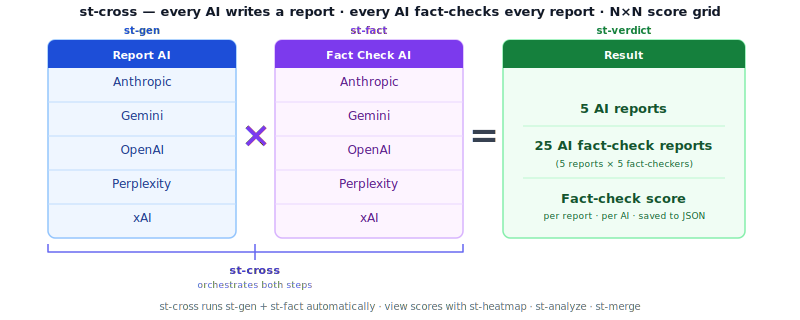

# st-cross — Run all AI providers and cross-check results

Runs the full research pipeline in one command: generates a report from every AI provider, then has every AI fact-check every report. The result is an N×N score matrix saved into the container.



`st-cross` is the orchestrator: it calls **[st-gen](st-gen)** to generate every report, then calls **[st-fact](st-fact)** to run every fact-check. The scores land in the Result column, ready for **[st-verdict](st-verdict)** to summarise.


**Run after:** `st-new`    **Run before:** `st-merge`  `st-heatmap`  `st-verdict`  `st-analyze`

**Related:** [st-bang](st-bang)  [st-fact](st-fact)  [st-heatmap](st-heatmap)  [st-verdict](st-verdict)

---

## Examples

```bash
st-cross subject.json                   # full N×N run: generate + fact-check all AIs
st-cross --no-cache subject.json        # force fresh API calls (no cache)
st-cross --skip-gen subject.json        # skip generation — only run fact-checking
st-cross --timeout 3600 subject.json    # set a 60-minute per-job timeout
st-cross -q subject.json                # minimal output (suppress live table)
```

## Options

| Option | Description |
|--------|-------------|
| `file.json` | Path to the JSON container |
| `--cache` | Enable API cache (default: enabled) |
| `--no-cache` | Disable API cache — always call AI live |
| `--skip-gen` | Skip Step 1 (story generation). Auto-detected if all stories already exist. |
| `--timeout TIMEOUT` | Per-job timeout in seconds (default: 1800 = 30 min). `0` = no timeout. |
| `-v`, `--verbose` | Verbose output |
| `-q`, `--quiet` | Suppress live table (minimal output) |

---

## For developers

Step 1 runs `st-gen --prep` per AI in parallel threads. Step 2 fact-checks all N×N pairs — each column (fact-checker AI) is a separate thread, serializing writes per story to avoid JSON corruption. The live ANSI display is updated every second. Ctrl+C preserves results collected so far.
