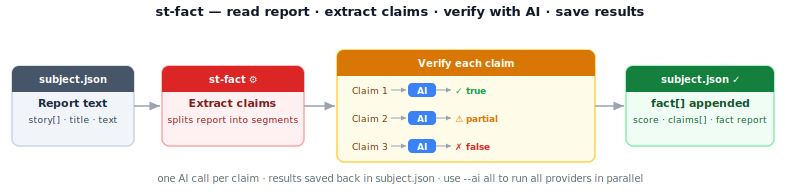

# st-fact — Fact-check stories in a container

Sends a single story to an AI and asks it to fact-check every claim, scoring each one true, partially true, or false. Appends the result to the container.

**Run after:** `st-prep`    **Run before:** `st-fix`  `st-heatmap`



```bash
st-fact subject.json                    # fact-check story 1 with default AI
st-fact -s 2 --ai gemini subject.json  # fact-check story 2 with Gemini
st-fact --no-cache subject.json        # bypass API cache
st-fact --all subject.json             # fact-check all stories in the container
st-fact --ai all subject.json          # run all AIs in parallel (one per story)
st-fact --timeout 30 subject.json      # 30-second per-paragraph timeout
st-fact --file subject.json            # also write results to a file
st-fact --paragraph subject.json       # write paragraph segments to _paragraph_test_n.txt
```

## Options

| Option | Description |
|--------|-------------|
| `-s N`, `--story N` | Fact-check a single story by number (default: 1) |
| `--all` | Fact-check every story in the container |
| `--ai AI` | AI provider to use, or `all` to run all providers in parallel (default: `xai`) |
| `--cache` | Enable the API response cache (default: enabled) |
| `--no-cache` | Bypass the API response cache |
| `--file` | Also write results to a `.txt` file alongside the container |
| `--paragraph` | Write paragraph segments to `_paragraph_test_N.txt` for debugging |
| `--display` | Write results to the display (default: on) |
| `--silent` | Suppress all output including progress bars; used internally by `st-cross` |
| `-v`, `--verbose` | Verbose output |
| `-q`, `--quiet` | Minimal output |
| `--timeout N` | With `--ai all`: per-job limit in minutes (default: 20). Single-AI mode: per-paragraph limit in seconds (default: 0 = no limit) |

## What happened to `--ai-review` / `--ai-caption` / `--ai-summary` / …?

These interpretive flags **moved to `st-verdict` in cross-st 0.7.0**. `st-fact` is now a pure verifier: it produces fact-check data; `st-verdict` interprets it. This is the GATHER → VERIFY → INTERPRET architecture.

| Old (st-fact) | New (st-verdict) |
|---|---|
| `st-fact --ai-review subject.json` | `st-verdict --what-is-false subject.json` *(or `--what-is-true` / `--what-is-missing`)* |
| `st-fact --ai-title subject.json` | `st-verdict --ai-title subject.json` |
| `st-fact --ai-short subject.json` | `st-verdict --ai-short subject.json` |
| `st-fact --ai-caption subject.json` | `st-verdict --ai-caption subject.json` |
| `st-fact --ai-summary subject.json` | `st-verdict --ai-summary subject.json` |
| `st-fact --ai-story subject.json` | `st-verdict --ai-story subject.json` |

If you call any of the removed flags, `st-fact` exits with a one-line error pointing at the right `st-verdict` invocation — no silent failure.

**See also:** [Three Stages](Three-Stages) — the GATHER → VERIFY → INTERPRET architecture this migration is part of.

## For developers

Splits the story into segments via `mmd_util.build_segments()`, sends them to the AI, and appends a `fact[]` entry to the container. The entry includes `score`, `counts`, `summary`, `claims[]` (per-segment verdicts), and `timing{}`.
