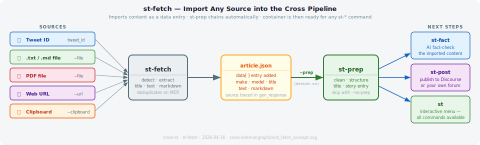

# st-fetch — Import Any Source into the Cross Pipeline

Brings external content into Cross as a data entry and immediately chains to `st-prep` — so the imported material is cleaned, titled, and ready for fact-checking or publishing without any extra steps.

Five source types are supported: a tweet by ID, a local `.txt` or `.md` file, a **PDF file** (auto-detected by extension or magic bytes), a web page by URL, or text pasted from the clipboard. The source type is recorded in `make`/`model` so every entry stays traceable.



---

## Sources

| Source | Flag | Notes |
|--------|------|-------|
| X / Twitter post | `tweet_id` (positional) | Requires `X_COM_BEARER_TOKEN` in `.env` |
| Plain text or Markdown file | `--file PATH` | `.txt`, `.md` — content imported as-is |
| PDF file | `--file PATH` | Auto-detected by `.pdf` extension or `%PDF` magic bytes; `pymupdf4llm` auto-installed on first use |
| Web page | `--url URL` | Scrapes visible text; strips nav/script/footer noise |
| Clipboard | `--clipboard` | macOS (`pbpaste`), Linux (`xclip`/`xsel`), Windows (PowerShell) |

### PDF import

PDF files are converted to structured Markdown using `pymupdf4llm`, preserving headings, bold/italic, lists, and tables. The `title` field is resolved from PDF metadata first, then from the first `#` heading, then from the first non-empty line of text. If very little text is extracted the tool warns that the file may be scanned and suggests running OCR first.

`pymupdf4llm` is not included in the base install (it pulls in a 22 MB native library). On your first PDF import, `st-fetch` installs it automatically:

```
$ st-fetch --file paper.pdf article.json
  PDF support not installed — installing now (one-time, ~22 MB)…
  PDF support installed. ✓
  Importing file: paper.pdf… ✓
```

Every subsequent PDF import runs immediately with no delay. Non-PDF users are unaffected.

---

## Pipeline

`st-fetch` stores the imported content as a `data[]` entry in the container. By default it immediately runs `st-prep`, which cleans the text and creates a `story[]` entry — making the content available to every other `st-*` command without any further manual steps.

```
source  →  st-fetch  →  article.json  →  st-prep  →  st-fact / st-post / st
```

Use `--no-prep` to store the raw data entry only and run `st-prep` yourself later.

---

## Examples

```bash
st-fetch <tweet_id> article.json              # import an X / Twitter post
st-fetch --file report.txt article.json       # import a plain text file
st-fetch --file report.md article.json        # import a Markdown file
st-fetch --file paper.pdf article.json        # import a PDF
st-fetch --url https://... article.json       # scrape a web page
st-fetch --clipboard article.json             # import from clipboard

st-fetch --file paper.pdf article.json --no-prep     # store raw data only
st-fetch <tweet_id> article.json --no-cache          # bypass cache, fetch live
```

Full import-and-publish pipeline:

```bash
st-fetch --file report.pdf article.json   # import PDF → auto-runs st-prep
st-fact article.json                      # AI fact-check
st-post article.json                      # publish to Discourse
```

---

## Options

| Option | Description |
|--------|-------------|
| `tweet_id` | Tweet / X post ID to fetch (numeric ID from post URL) |
| `file.json` | Path to the `.json` container |
| `--file PATH` | Import a `.txt`, `.md`, or `.pdf` file from disk |
| `--url URL` | Fetch a web page and extract its visible text |
| `--clipboard` | Import text from the system clipboard |
| `--cache` | Enable API cache (default: on) |
| `--no-cache` | Disable API cache — always fetch live |
| `--prep` | Run `st-prep` after fetching (default: on) |
| `--no-prep` | Skip `st-prep` — store as raw data entry only |
| `-v`, `--verbose` | Verbose output |
| `-q`, `--quiet` | Minimal output |

---

**Related:** [st-prep](st-prep)  [st-fact](st-fact)  [st-post](st-post)  [st-gen](st-gen)

---

## For developers

`AI_MAKE` is set to `"st-fetch"` and `model` records the source type: `"file"`, `"pdf"`, `"clipboard"`, `"x.com"`, or the URL domain (e.g. `"bbc.co.uk"`). `gen_response` includes a `format` key for PDF entries (`"pdf"`) and a `pages` count. Twitter/X fetches require `X_COM_BEARER_TOKEN` in `.env`. Entries are deduplicated by MD5 hash before writing.
