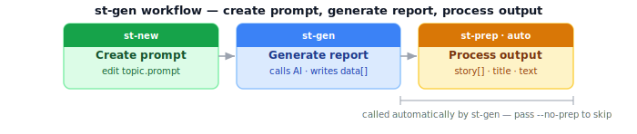

# st-gen — Generate a report from a prompt

Sends your prompt file to an AI provider and saves the raw response into a `.json` container. After generating, it automatically calls `st-prep`, converting the raw AI data into the presentation products — title, clean text, hashtags — needed for further analysis and publication. Pass `--no-prep` to store raw data only. This is the first step — the container it creates is used by every other command.

**Run after:** `st-new`  ·  **Calls automatically:** `st-prep`  ·  **Run before:** `st-bang`, `st-cross`, `st-fact`

---



---

## Examples

```bash
st-gen subject.prompt                   # generate with default AI (runs st-prep automatically)
st-gen --ai gemini subject.prompt       # use a specific provider
st-gen --no-cache subject.prompt        # bypass API cache
st-gen --no-prep subject.prompt         # store raw data only, skip st-prep
```

## Options

| Option | Description |
|--------|-------------|
| `file.prompt` | Path to the `.prompt` file |
| `--ai NAME` | AI provider to use (default: your configured default) |
| `--cache` | Enable API cache (default: enabled) |
| `--no-cache` | Bypass API cache — always call the AI live |
| `--no-prep` | Store raw AI data only; skip the automatic `st-prep` call |
| `--ai-title` | Generate a ≤10-word title → stdout |
| `--ai-short` | Generate a ≤80-word summary → stdout |
| `--ai-caption` | Generate a 100–160-word caption → stdout |
| `--ai-summary` | Generate a 120–200-word summary → stdout |
| `--ai-story` | Generate an 800–1200-word narrative → stdout |
| `--bang N` | Internal flag used by `st-bang` — do not call directly |
| `-v`, `--verbose` | Verbose output |
| `-q`, `--quiet` | Minimal output |

**Related:** [st-bang](st-bang) · [st-prep](st-prep) · [AI Providers](ai-providers)

---

## For developers

Writes a new entry to `data[]` in the container. Caching is MD5-keyed on the serialized request payload — two identical prompts to the same model always hit the cache. `--bang N` is used internally by `st-bang` (writes to `tmp/` and creates a block file); don't call it directly.
