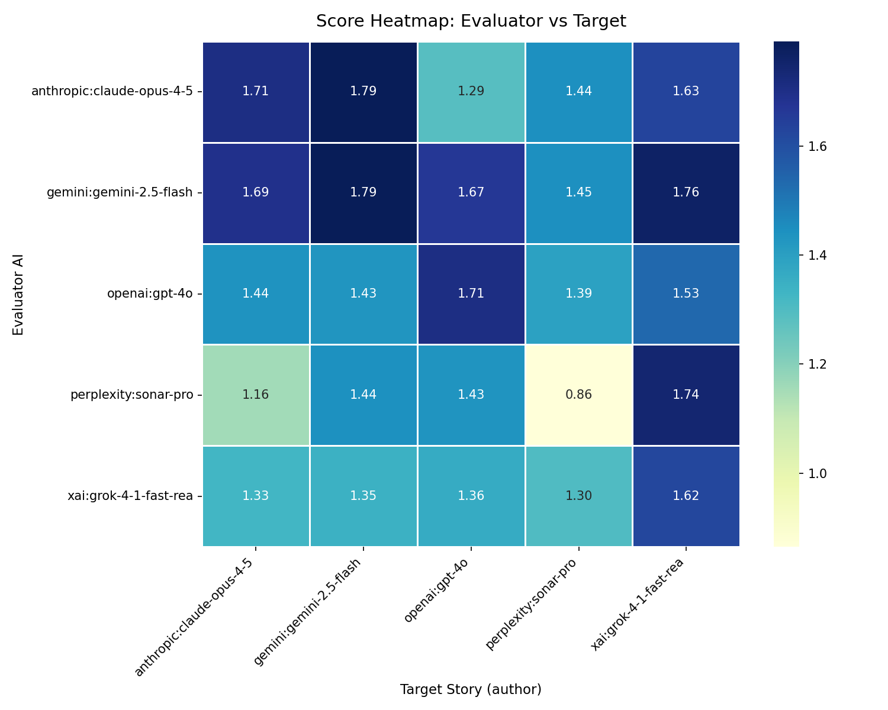

# st-heatmap — Plot a cross-product fact-check score heatmap

Generates a color-coded grid showing how every AI-pair scored in the cross-product
fact-check. **Rows** are evaluator AIs; **columns** are target story authors.
Darker cells = higher veracity scores. The diagonal shows self-evaluation scores.

**Run after:** `st-cross`

## Examples

```bash
st-heatmap --display subject.json                        # show chart on screen
st-heatmap --file subject.json                           # save PNG to ./tmp/
st-heatmap --display --ai-caption subject.json           # chart + AI narrative (default AI)
st-heatmap --file --ai-caption --ai openai subject.json  # save PNG + caption via openai
st-heatmap --file --ai-title --ai gemini subject.json    # save PNG + title via gemini
st-heatmap --display --file --ai-summary subject.json    # screen + save PNG + summary
st-heatmap --display --file --ai-story subject.json      # screen + save PNG + full story
```

## Options

### Chart output

| Flag | Description | Default |
|------|-------------|---------|
| `--display` | Display heatmap on screen | off |
| `--file` | Save heatmap as PNG | off |
| `--path PATH` | Output directory for PNG | `./tmp` |

### AI content generation

All AI flags print generated text to stdout after the chart is produced.
Combine with `--file` to save the chart and generate content in one command.

| Flag | Output | Word limit |
|------|--------|------------|
| `--ai-title` | Short title for the heatmap | ≤ 10 words |
| `--ai-short` | Short caption | ≤ 80 words |
| `--ai-caption` | Detailed caption with patterns and outliers | 100–160 words |
| `--ai-summary` | Concise summary | 120–200 words |
| `--ai-story` | Comprehensive narrative | 800–1,200 words |

Use `--ai NAME` to select the provider (default: your `DEFAULT_AI` setting).
Supported: `anthropic`, `xai`, `gemini`, `openai`, `ollama`.

### Other

| Flag | Description |
|------|-------------|
| `--ai AI` | AI provider for content generation (default: `xai`) |
| `--cache` | Enable API response cache (default: on) |
| `--no-cache` | Disable API cache for this run |
| `-v`, `--verbose` | Verbose output |
| `-q`, `--quiet` | Minimal output |

---

## Example output

The heatmap below was generated from a pizza dough fact-checking run across 5 AI
providers using `--file --ai-caption`:

```bash
st-heatmap --ai openai --ai-caption --file pizza_dough.json
```



**AI-generated caption** (`--ai-caption`, via `openai`):

> This heatmap evaluates the veracity of AI-generated content focused on the domain
> of crafting homemade pizza dough, with scores ranging from 0.9 to 1.8. In terms
> of column patterns, the target AI "gemini:gemini-2.5-flash" boasts a consistently
> dark column, indicating it is highly trusted across all evaluators. Conversely,
> "perplexity:sonar-pro" shows a lighter column, suggesting that its stories are
> viewed with more skepticism. Evaluator-wise, "gemini:gemini-2.5-flash" emerges as
> the most lenient, consistently giving higher scores. In contrast,
> "perplexity:sonar-pro" appears stricter, as evidenced by its lower scores across
> the board, reflecting a more conservative assessment of truthfulness.
>
> Examining the diagonal reveals a slightly darker hue compared to the surrounding
> cells, suggesting a mild self-promotion bias, where AIs rate their own work more
> favorably. A notable outlier is "perplexity:sonar-pro" evaluating itself with a
> score of 0.9, the lowest in the matrix. This score is explained by the presence of
> five partially false and two false counts, indicating a critical self-assessment.
> For technical readers interested in selecting an AI for pizza dough content,
> "gemini:gemini-2.5-flash" offers a reliable choice, consistently earning high trust
> scores from various evaluators.

---

## Reading the heatmap

- **Dark column** — that AI's reports are consistently trusted by all other evaluators
- **Light column** — that AI's reports are viewed with more scepticism
- **Dark row** — that evaluator is lenient (gives high scores to everyone)
- **Light row** — that evaluator is strict (gives low scores to everyone)
- **Diagonal** — self-evaluation; a darker diagonal suggests mild self-promotion bias
- **Single outlier cell** — one AI finds another's work significantly more or less credible

Scores above **1.5** indicate strong factual agreement. Scores below **1.0** suggest
frequent disagreement or identified errors.

---

**Related:** [st-cross](st-cross.md) · [st-verdict](st-verdict.md) · [st-speed](st-speed.md) · [st-analyze](st-analyze.md)

---

## For developers

Uses `mmd_data_analysis.get_flattened_fc_data()` to build the score matrix, then
renders with `mmd_plot`. AI content flags (`--ai-caption` etc.) call
`process_prompt()` from `ai_handler` with the flattened score data as context.
The `--path` directory is created automatically if it does not exist.
