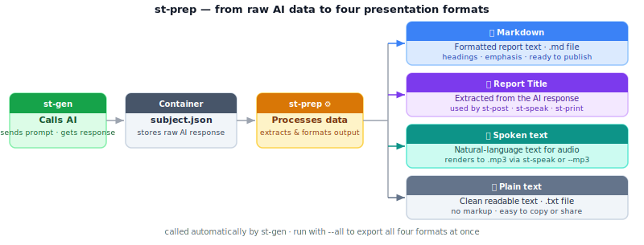

# st-prep — Process raw AI data into presentation formats

Takes the raw AI response stored in the container by `st-gen` and processes it into four presentation formats: **Markdown** (formatted report text ready for publishing), a report **Title** (extracted from the AI text), **spoken-word text** (cleaned for text-to-speech, renders to .mp3 via `st-speak` or `--mp3`), and **plain text** (.txt). These outputs feed every downstream command — `st-fact`, `st-post`, `st-speak`, and `st-print`.

**Run after:** `st-gen` · `st-fetch`  ·  **Run before:** `st-fact` · `st-post`

---



---

## Examples

```bash
st-prep subject.json              # process data entry 1, add story to container
st-prep -d 2 subject.json         # process data entry 2
st-prep -d 1 --mp3 subject.json   # also render an MP3 audio file
st-prep -d 1 --all subject.json   # export md, mp3, title, and txt files
```

**Options:** `-d`  `data`  `-a`  `all`  `--markdown`  `--mp3`  `--title`  `--txt`  `--bang`  `-v`  `-q`

**Related:** [st-gen](st-gen) · [st-fact](st-fact) · [st-speak](st-speak)

---

## For developers

Called automatically by `st-gen --prep`, `st-cross`, `st-fetch`, and `st-fix`. Writes to `story[]` in the container. TTS rendering (`--mp3`) uses `mmd_voice.py` and requires the TTS extras (`pip install 'cross-ai[tts]'`).
