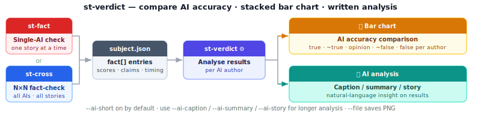
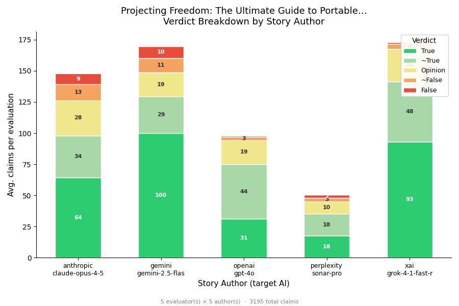

# st-verdict — Score AI accuracy and explain the results

Reads fact-check data from a container and produces two outputs: a **stacked bar chart** comparing each AI's accuracy (true · ~true · opinion · ~false · false breakdown per author), and an optional **written analysis** — a short caption on by default, or a longer caption, summary, or story via the `--ai-*` flags. Run after `st-fact` for a single-AI verdict, or after `st-cross` to compare all providers head-to-head.

**Run after:** `st-fact` · `st-cross`



## Example output



**`st-verdict --ai-caption projector_sonos_options.json`** — example caption (Gemini):

> This chart presents a cross-AI fact-check on stories detailing RV and portable entertainment systems. XAI's Grok-4-1-fast-reasoning emerged as the most accurate AI author, with approximately 82% of its claims verified as True or ~True — significantly outperforming Anthropic's Claude-opus-4-5 at ~66%. Grok's superior performance stems from a high proportion of unequivocally True claims (54%) and a remarkably low False or ~False rate of just 3%, while Claude exhibited a combined inaccuracy rate of 15%.

---

## Options

| Option | Description |
|--------|-------------|
| `file.json` | Path to the JSON container |
| `--cache` | Enable API cache (default: enabled) |
| `--no-cache` | Disable API cache |
| `-v`, `--verbose` | Verbose output |
| `-q`, `--quiet` | Minimal output |

### Chart output

| Option | Description |
|--------|-------------|
| `--display` | Display chart on screen (default: on) |
| `--no-display` | Suppress on-screen display |
| `--file` | Save chart PNG to file (default: off) |
| `--path PATH` | Output directory for PNG (default: `./tmp/`) |

### AI content generation

| Option | Description |
|--------|-------------|
| `--ai-title` | Generate a ≤10-word title → stdout |
| `--ai-short` | Generate a ≤80-word short caption → stdout (**default: on** when no other `--ai-*` flag is given) |
| `--no-ai-short` | Suppress the automatic short caption |
| `--ai-caption` | Generate a 100–160-word detailed caption → stdout |
| `--ai-summary` | Generate a 120–200-word summary → stdout |
| `--ai-story` | Generate an 800–1200-word narrative → stdout |
| `--ai AI` | AI provider for content generation (default: `xai`) |

### What-is lens — focused claim breakdown

Switches the AI from "summarise the chart" to "summarise the **claims** that fall on one side of the truth ledger" — or, with `--what-is-missing`, to identify what the report failed to cover at all. Aggregates per-claim verdicts and explanations across **all** fact-checkers in the container, then asks one AI to synthesize them into a focused report. Pair with any `--ai-*` flag to control level of detail; `--ai-summary` is auto-enabled if no detail flag is given.

| Option | Description |
|--------|-------------|
| [`--what-is-false`](Showcase-Workflows#workflow-a--is-this-fake-news) | Aggregate every claim marked `false` / `partially_false` and produce a focused breakdown of what is inaccurate or disputed |
| [`--what-is-true`](Showcase-Workflows#workflow-c--what-can-i-trust-here) | Aggregate every claim marked `true` / `partially_true` and produce a focused breakdown of what is verified or supported |
| [`--what-is-missing`](Showcase-Workflows#workflow-b--whats-missing) | Identify what important aspects of the prompt the report failed to mention (omissions / coverage gaps) |
| `-s N`, `--story N` | Story index to analyse with the lens (default: `1`) |

The three lenses are mutually exclusive (and also exclusive with `--how-to-fix` below).

```bash
# Detailed breakdown of inaccurate claims (e.g. "is this fake news?")
st-verdict -s 1 --what-is-false --ai-summary subject.json

# Positive-evidence summary — what the report got right
st-verdict -s 1 --what-is-true --ai-caption subject.json

# Coverage-gap analysis — what the report failed to mention
st-verdict -s 1 --what-is-missing --ai-summary subject.json

# Long-form analysis suitable for sharing as feedback
st-verdict -s 1 --what-is-false --ai-story --no-display subject.json
```

> Each lens analyses **one** story at a time (the AI author at index `N`). `-s 1` is the default; pass `-s 2`, `-s 3`, … to inspect another author. To compare across authors, run the command once per index.

The lens reads `story[N].fact[]` entries — run `st-cross` first so multiple AIs have fact-checked the report. The more checkers that flagged the same claim, the stronger the signal in the resulting analysis. The `--what-is-missing` lens additionally reads the original prompt (`data[0].prompt`) and the report markdown so the AI can reason about what should be there but isn't.

**See also:** [Showcase Workflows](Showcase-Workflows) — copy-pastable transcripts for each lens.

### Recommendation lens — `--how-to-fix`

After looking at the chart and the lens output, the natural next question is "*so what do I do about it?*" The recommendation lens asks the AI to read the score breakdown, the verdict mix, and (at `--ai-summary` / `--ai-story` detail levels) the report itself, then recommend exactly **one** next action. The recommendation is human-facing prose; **st-verdict never auto-invokes** the suggested tool.

| Option | Description |
|--------|-------------|
| `--how-to-fix` | Recommend exactly one of: `st-fix`, `st-bang -N`, `st-merge`, or `publish-as-is`. Default detail level: `--ai-short` (single concrete recommendation sentence). |

The four candidate actions and when each is recommended:

| Recommendation | Triggered when |
|---|---|
| `st-fix subject.json` | Report is mostly sound but has clusters of false / partially_false claims |
| `st-bang -N subject.json` | Sample size too small (one story) or scores vary wildly across fact-checkers |
| `st-merge subject.json` | Multiple stories already present; combining their strongest sections beats any single one |
| `publish-as-is` | Per-author scores are high (avg ≥ 1.5) AND zero false / partially_false claims |

The output's last line always has the exact shape `Recommendation: <command> — <reason>.` so it is easy to spot in a terminal scrollback.

```bash
# One-line recommendation (default)
st-verdict -s 1 --how-to-fix subject.json

# Three-paragraph technical recommendation with alternatives considered
st-verdict -s 1 --how-to-fix --ai-summary subject.json

# Long-form recommendation analysis suitable for archival
st-verdict -s 1 --how-to-fix --ai-story --no-display subject.json
```

> **Architectural note:** As of cross-st 0.7.0, all interpretive `--ai-*`, `--what-is-*`, and `--how-to-fix` flags live here in `st-verdict`. `st-fact` is now a pure verifier (it produces fact-check data; `st-verdict` interprets it). This is the **[GATHER → VERIFY → INTERPRET](Three-Stages)** division of responsibility.

**Related:** [Three Stages](Three-Stages)  [Showcase Workflows](Showcase-Workflows)  [st-cross](st-cross)  [st-heatmap](st-heatmap)  [st-analyze](st-analyze)

---

## For developers

Built on `mmd_plot.py`. Data comes from `mmd_data_analysis.get_flattened_fc_data()`.
